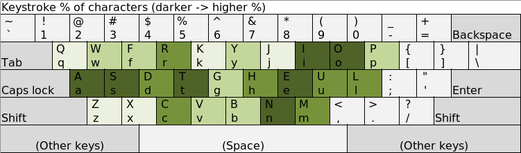

# Power Keyboard Layout

Keyboard layout different than QWERTY, possibly with better key placements. Note
that the layout's name is "Power" for no particular reason. An acronym to
refer to it is "PKL".

To train your skills, you can use the CLI tool [Keyboard Warrior][ref_1]!

## Purpose

Keys in the [QWERTY][ref_2] keyboard layout are apparently not placed ideally.
Some letters are used more frequently than others. For instance, in English,
the frequencies of the letters 'E' and 'Z' are 12.702% and 0.074%<sup>[1]</sup>.
Many keyboard layouts, such as Dvorak and Colemak have been made to address
that. What I do not like about these is that the location of so many keys are
changed from their location in QWERTY that it is very burdensome to learn these
layouts. The goal of the Power keyboard layout is to change *some* important
letters, but as few as possible, in order to have a strong ratio of positive
impact of the change vs the time to adapt to the changes.

[1]: https://en.wikipedia.org/wiki/Letter_frequency

See how PKL positions the keys and their frequencies:


The layout also advocates for a new position of the right hand. Instead of
holding the fingers at the "Home Row" (on "JKL;"/"EUL;" in QWERTY/PKL setups),
you put them in a kind of circle such that the right thumb presses on the N key,
so you have 5 fingers on letters instead of having the thumb on the space bar:
"NJIOP"/"NEIOP" in QWERTY/PKL setups.

## Concept

To change a new layout or change an existing one, in Linux and Mac, you can
modify text files. In Windows 7, you have to use a tool provided my Microsoft.
For the moment, this repository concentrates on Linux.

Only 6 keys change location: E, T, U, F, J and K. The following list shows where
a letter will go using the destination as the position of a letter in the QWERTY
layout. To change your keyboard, you can first remove the E key, then move the
following keys in order (where they'd be in a QWERTY layout):

- F &rarr; E
- T &rarr; F
- K &rarr; T
- U &rarr; K
- J &rarr; U
- E &rarr; J

Note that your keyboard might have ridges or shapes in the keys that prevent
them from being moved adequately. If so, you can try removing/modifying the
ridges/shapes. Otherwise, it's better to keep the keys in their original
positions; then, you'll just have to remember what the keys actually stand for
(not much of a problem if you already can touch type).

Furthermore, on Linux, the left Alt key is changed so it moves the keys on the
right of they keyboard 3 keys to the left. This allows to reach keys at the
right of the right hand without moving the fingers extensively. For instance,
instead of moving a finger to press on the Enter/Return key, you can hold on
the left Alt with your thumb, and then press on the L key (which now registers
as Enter/Return).

Also, on Linux, a slight detail, but I've overriden the MENU key (on the right
between the Power/Windows and Control keys) to map to accents and other
characters when holding it and pressing on the A, S, D, T, and C keys.

## Implementation

### Linux

An implementation was only done for the [X Window System][ref_3].

Before attempting this, you should try it in a virtual machine in case problems
occur. If there are problems, the system might not be able to load correctly,
and you'll have to log into recovery mode, which can be annoying.

#### Installation

The file `install.sh` partly automates the installation.

I've not yet thoroughly understood the system that allows different keyboard
formats, so for now some files have to be overwritten.

Download the files in `./keyboard-layout-files/` onto your computer. Two of
those are backup files. It's probably best to copy your current files directly
from `/usr/share/X11/xkb/symbols/` as backups. Copy the files `us` and `level5`.

Next, copy the PKL files:
```
sudo cp pkl-us /usr/share/X11/xkb/symbols/us
sudo cp pkl-level5 /usr/share/X11/xkb/symbols/level5
```

After that, the changes need be registered. This can possibly be done by
unplugging your keyboard and back in. Otherwise, you can log out and back in.

#### If your system won't start as usual

Reboot, and chose the recovery mode from the GRUB menu (if it does not
appear, pressing the ESC key might make it appear on the next reboot). This
should log you in as root. Then, put back your backup files appropriately (so
remember `/usr/share/X11/xkb/symbols/`, `us` and `level5`).

### Mac

You can use the tool [Ukelele](https://software.sil.org/ukelele/) to create
custom keyboard layouts.

I've not yet the files for the updated version of PKL, so more needs to done
here eventually...

### Windows

To be written...

[ref_1]: https://github.com/pat-laugh/keyboard-warrior
[ref_2]: https://en.wikipedia.org/wiki/QWERTY
[ref_3]: https://en.wikipedia.org/wiki/X.Org_Server
